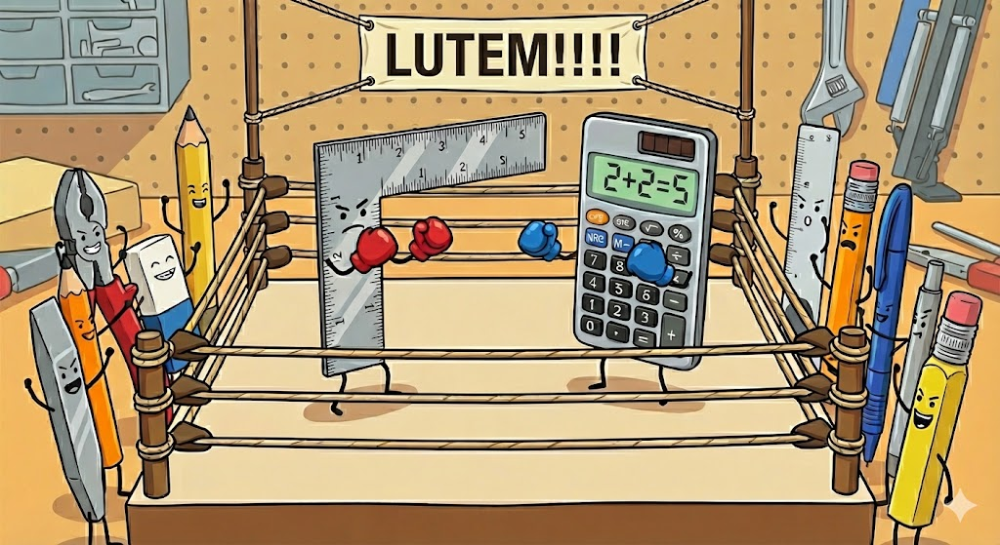

<!--
footer: https://github.com/andreyev/finops-design_over_costs
-->

# **FinOps é mais sobre arquitetura do que sobre fatura**

---

_Avisos_ :
* URL do repositório (quase) sempre no rodapé.
* Esta apresentação surgiu de conversas, provocações e estudos na comunidade e está disponível para ela (CC-BY-4.0).
* As opiniões expressas aqui são de responsabilidade exclusiva do autor e não refletem as opiniões ou posições de quaisquer entidades com as quais o autor esteja associado.

---

#  _$ whoami_

---

# _~~$ whoami~~_
- Blá blá blá

---

> Semanas de codificação podem economizar horas de planejamento.

---

<h1>FinOps é mais sobre arquitetura do que sobre fatura.</h1>

---
## Finops
> ...é uma **estrutura operacional** e uma **prática cultural** que **maximiza o valor comercial da nuvem e da tecnologia**...

https://www.finops.org/introduction/what-is-finops/

---

| Funcionalidade | FinOps 1.0 |
| :---: | :---: |
| Escopo | Nuvem pública |
| Foco | "O quê" & "Quanto" |
| Padrões  de dados | Dependente do provedor |
| Objetivo | Redução |

---

| Funcionalidade | FinOps 1.0 | FinOps 2.0 |
| :---: | :---: | :---: |
| Escopo | Nuvem pública | .aaS, on-prem etc |
| Foco | "O quê" & "Quanto" | "Por que" |
| Padrões  de dados | Dependente do provedor | Evolução do FOCUS |
| Objetivo | Redução | Otimização |

---

## Finops
> ...é uma **estrutura operacional** e uma **prática cultural** que **~~maximiza~~otimiza o valor comercial da nuvem e da tecnologia**...

---

## Arquitetura de software

---

## Arquitetura de software
> ... consiste na definição dos **componentes**, suas **propriedades** e seus **relacionamentos**.

https://pt.wikipedia.org/wiki/Arquitetura_de_software

---

## Arquitetura de software
* Paradigmas e modelos
* Metodologias e frameworks
* Padrões e corpos de conhecimento
* Disciplinas de suporte
* Etc

---

## Arquitetura de software
* Paradigmas e modelos: Agile, Espiral, Cascata etc
* Metodologias e frameworks: .DD, Lean, RUP, SAFe, Scrum, XP etc
* Padrões e corpos de conhecimento: ITIL, CMMI, ISO 9001, PMBOK etc
* Disciplinas de suporte: Gestão de configuração, Gestão de projetos, QA etc
* Etc etc etc heelp

---

## Arquitetura de software
> é um conjunto de práticas, padrões e metodologias para fugir e evitar o CAOS

---

## Arquitetura de software
> ... é uma abstração **"intelectualmente compreensível"** de um sistema complexo.

Bass, Len; Paul Clements; Rick Kazman (2012). Software Architecture in Practice

---

## Arquitetura de software
* Compreensível
* Comunicável
* Colaborativo
* Planejável
* Executável
* Mensurável

---

## Mensurabilidade

* Indicadores e métricas

---

## Mensurabilidade

* Indicadores e métricas: Lead Time from Changes, MTTR, KLOC, DER, WTF, débito técnico, cobertura de testes etc

---

## Mensurabilidade

* Dinheiros?

---

---

## Arquitetura x fatura
* Dividir um monolito em micro-serviços é uma decisão de arquitetura para promover a colaboração...
* ... tendo o reuso como benefício colateral.

---

## Arquitetura x fatura
* Usar IaC para criar o cluster de homologação quando for usa-lo evita a sua divergência do cluster de produção...
* ... e economiza um cluster em execução. 

---

## Arquitetura x fatura
* Reduzir a dependência de muitas bibliotecas simplifica a gestão delas e reduz o risco de falhas...
* ... assim como reduz tempos de construção, download, upload, teste etc.

---

## Arquitetura x fatura
* Padronização ("Estrada pavimentada") reduz a carga cognitiva...
* ... e também reduz tempo/custo de aplicar correções e atualizações.

---

## Arquitetura x fatura
* Definir ciclo de vida de dados reduz perda de desempenho pelo acumulo deles...
* ... e economiza em armazenamento.

---

## Arquitetura x fatura
* Desacoplar provedores evita _lock-ins_...
* ... mas também permite troca-los quando ficam caros demais.

---

## Arquitetura x fatura
* Uma arquitetura orientada a eventos tem alta tolerância a falhas...
* ... e a sua escalabilidade reduz os recursos ociosos.

---

> A simplicidade é uma grande virtude, mas exige trabalho árduo para ser alcançada e conhecimento para ser apreciada. E, para piorar a situação, a complexidade vende melhor.

Dijkstra (1984) On the nature of Computing Science (EWD896).

---

## Uma boa arquitetura é naturalmente:

---

## Uma boa arquitetura é/tende a ser naturalmente:
* Eficiente
* Elegante
* Enxuta
* Econômica

---

# **Obrigado!!!!!!1**
